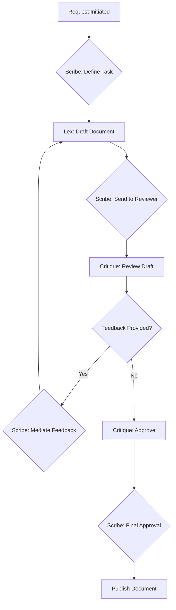

# Documentation Workflow

This document outlines the process for creating, reviewing, and publishing documentation using the specialized multi-agent team managed by the Scribe orchestrator.

## Roles

*   **Scribe (Orchestrator):** Manages the end-to-end documentation process, assigns tasks, and ensures quality.
*   **Lex (Writer):** Drafts the technical documentation based on input from Scribe.
*   **Critique (Reviewer):** Reviews drafts for accuracy, clarity, and style.

## The Workflow

The documentation process follows these steps:

1.  **Initiation:** A documentation request is made. This can be triggered by new code, a feature update, or a need to improve existing documentation.

2.  **Task Definition:** Scribe receives the request and gathers all necessary context. This includes:
    *   Relevant source code files.
    *   Developer notes or specifications.
    *   Information about the target audience.
    *   The desired format for the documentation.

3.  **Drafting:** Scribe assigns the writing task to Lex, providing all the collected context. Lex then generates the first draft of the documentation.

4.  **Review:** Once the draft is complete, Scribe passes it to Critique. Critique reviews the document against a checklist that includes technical accuracy, clarity, completeness, and style guide adherence.

5.  **Feedback and Iteration:** Critique provides detailed, constructive feedback. Scribe facilitates the feedback loop between Lex and Critique. Lex revises the draft based on the feedback, and this cycle continues until Critique approves the document.

6.  **Final Approval:** Scribe performs a final check to ensure the documentation meets all requirements and is ready for publication.

7.  **Publication:** The approved documentation is published to the relevant location (e.g., a documentation website, a project wiki, or included in the codebase).

8.  **Maintenance:** Documentation is a living part of the project. The workflow can be re-initiated to update existing documentation as the project evolves.

## Flow Diagram

